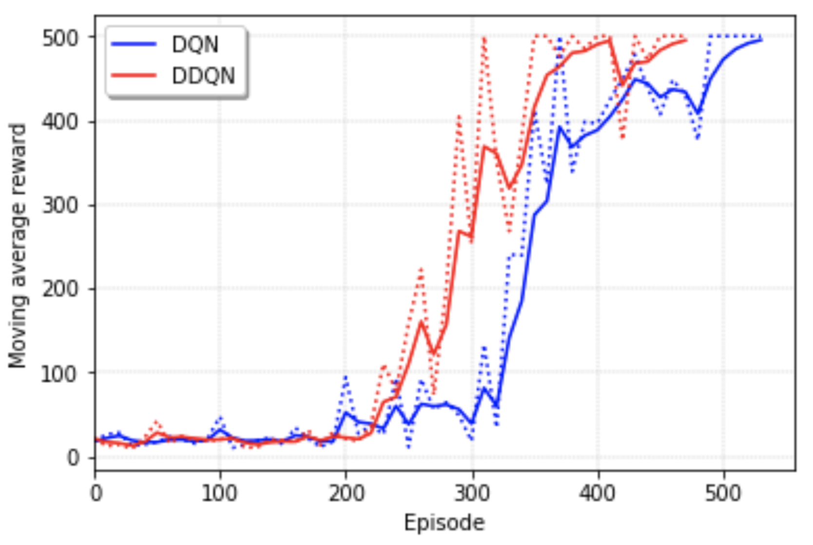
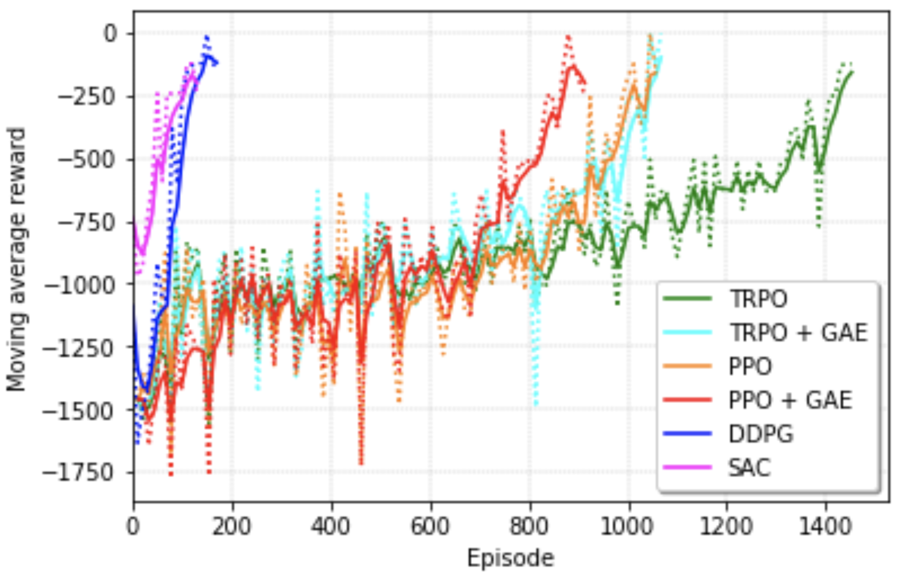

# Deep Reinforcement Learning Code

This repository contains code for **Deep Reinforcement Learning (DRL) algorithms** with PyTorch (v0.4.1). It also provides lecture materials that explain code in detail.

The agents with the DRL algorithms are implemented and trained using classic control environments.

- [CartPole](https://gym.openai.com/envs/CartPole-v1/)
- [Pendulum](https://gym.openai.com/envs/Pendulum-v0/)

## Table of Contents

### 00. Prerequisite

1. [Install from Anaconda to OpenAI Gym (Window Ver. & MacOS Ver.)](https://github.com/dongminlee94/Samsung-DRL-Code/tree/master/0_Prerequisite/01_Install)
2. [Numpy](https://github.com/dongminlee94/Samsung-DRL-Code/tree/master/0_Prerequisite/02_Numpy)

### 01. Deep Learning with PyTorch

- [PDF](https://github.com/dongminlee94/Samsung-DRL-Code/blob/master/1_DL_Pytorch/DL_PyTorch.pdf)
- [Code](https://github.com/dongminlee94/Samsung-DRL-Code/blob/master/1_DL_Pytorch/PyTorch.py)

### 02. Deep Q-Network (DQN) & Double DQN (DDQN)

- [PDF](https://github.com/dongminlee94/Samsung-DRL-Code/blob/master/2_DQN_DDQN/DDQN.pdf)
- [DQN Code](https://github.com/dongminlee94/Samsung-DRL-Code/tree/master/2_DQN_DDQN/dqn)
- [DDQN Code](https://github.com/dongminlee94/Samsung-DRL-Code/tree/master/2_DQN_DDQN/ddqn)

### 03. Advantage Actor-Critic (A2C) & Deep Deterministic Policy Gradient (DDPG)

1. A2C
   - [PDF](https://github.com/dongminlee94/Samsung-DRL-Code/blob/master/3_A2C_DDPG/A2C.pdf)
   - [Code](https://github.com/dongminlee94/Samsung-DRL-Code/tree/master/3_A2C_DDPG/a2c)

2. DDPG
   - [PDF](https://github.com/dongminlee94/Samsung-DRL-Code/blob/master/3_A2C_DDPG/DDPG.pdf)
   - [Code](https://github.com/dongminlee94/Samsung-DRL-Code/tree/master/3_A2C_DDPG/ddpg)

### 04. Trust Region Policy Optimization (TRPO) & Proximal Policy Optimization (PPO)

1. TRPO
   - [PDF](https://github.com/dongminlee94/Samsung-DRL-Code/blob/master/4_TRPO_PPO/TRPO.pdf)
   - [Code](https://github.com/dongminlee94/Samsung-DRL-Code/tree/master/4_TRPO_PPO/trpo)

2. TRPO + GAE
   - [PDF](https://github.com/dongminlee94/Samsung-DRL-Code/blob/master/4_TRPO_PPO/GAE.pdf)
   - [Code](https://github.com/dongminlee94/Samsung-DRL-Code/tree/master/4_TRPO_PPO/trpo_gae)

3. PPO
   - [Code](https://github.com/dongminlee94/Samsung-DRL-Code/tree/master/4_TRPO_PPO/ppo)

4. PPO + GAE
   - [PDF](https://github.com/dongminlee94/Samsung-DRL-Code/blob/master/4_TRPO_PPO/PPO.pdf)
   - [Code](https://github.com/dongminlee94/Samsung-DRL-Code/tree/master/4_TRPO_PPO/ppo_gae)

### 05. Soft Actor-Critic (SAC)

- [PDF](https://github.com/dongminlee94/Samsung-DRL-Code/blob/master/5_SAC/SAC.pdf)
- [Code](https://github.com/dongminlee94/Samsung-DRL-Code/tree/master/5_SAC/sac)

## Learning curve

### CartPole

### Pendulum

## Reference

- [Minimal and Clean Reinforcement Learning Examples in PyTorch](https://github.com/reinforcement-learning-kr/reinforcement-learning-pytorch)
- [Pytorch implementation for Policy Gradient algorithms (REINFORCE, NPG, TRPO, PPO)](https://github.com/reinforcement-learning-kr/pg_travel)
- [Pytorch implementation of SAC1](https://github.com/vitchyr/rlkit/tree/master/rlkit/torch/sac)
- [Pytorch implementation of SAC2](https://github.com/pranz24/pytorch-soft-actor-critic)
